# NXP Application Code Hub

## PCA9420UK-EVM : PMIC for Low Power Applications
The PCA9420 are highly integrated power management IC, targeted to provide power management solution for low-power microcontroller applications or other similar applications powered by Li-ion battery and/or 5 V adapter non-portable applications.

These devices integrate 2x buck converters, 2x LDOs with programmable output voltage range. PCA9420 also integrates a linear battery charger capable of charging up to 315 mA current with I²C programmable constant current (CC) and constant voltage (CV) values.

This demo application provides a command line interface which allows the user to easily explore the different functions of the driver to configure different device configurations of PCA9420UK-EVM.

### PCA9420UK-EVM Block Diagram

[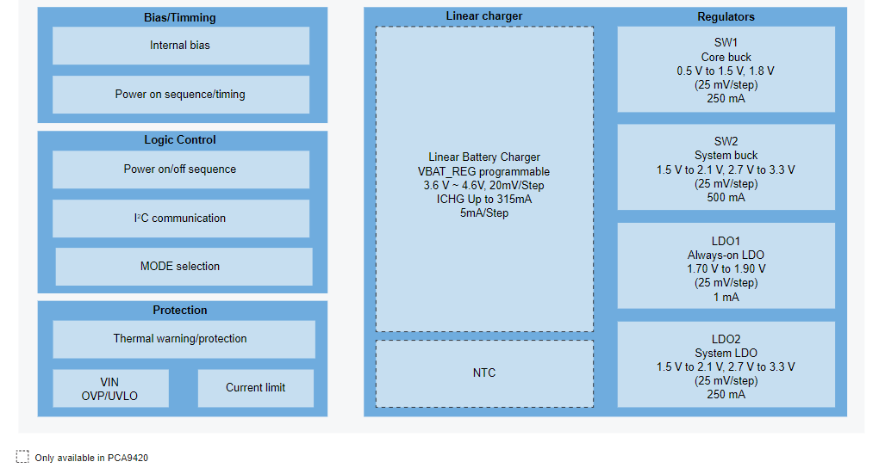](PCA9420_Block_Diagram.PNG)

### Key Features of PCA9420UK-EVM: PMIC for Low power microcontroller
- Linear battery charger for charging single cell li-ion battery:
  - 20 V tolerance on VIN pin
  - Programmable input OVP (5.5 V or 6 V)
  - Programmable constant current (up to 315 mA) and pre-charge low voltage current threshold
  - Programmable constant voltage regulation
  - Programmable automatic recharge voltage and termination current threshold
  -  Built-in protection features such as input OVP, battery SCP, thermal protection
  - Over-temperature protection
  
- Two step-down DC-DC converters
  - Programmable output voltage
  - SW1: core buck converter, 0.5 V to 1.5 V output, 25 mV/step, and a fixed 1.8 V, up to 250 mA
  - SW2: system buck converter, 1.5 V to 2.1 V/2.7 V to 3.3 V output, 25 mV/step, up to 500 mA
  - Low-power mode for extra power saving

- Two LDOs
  - Programmable output voltage regulation
  - LDO1: always-on LDO, 1.70 V to 1.90 V output, 25 mV/step, up to 1 mA
  - LDO2: system LDO, 1.5 V to 2.1 V/2.7 V to 3.3 V output, 25 mV/step, up to 250 mA

#### Boards: FRDM-MCXN947, FRDM-MCXA153
#### Categories: PMIC
#### Peripherals: I2C
#### Toolchains: MCUXpresso IDE

## Table of Contents
1. [Software](#step1)
2. [Hardware](#step2)
3. [Setup](#step3)
4. [Test Application Steps](#step4)
5. [FAQs](#step5) 
6. [Support](#step6)
7. [Release Notes](#step7)

## 1. Software
- [IoT Sensing SDK (ISSDK) v1.8](https://nxp.com/iot-sensing-sdk) offered as middleware in MCUXpresso SDK for supported platforms
- [MCUXpresso IDE v11.9.0](https://www.nxp.com/design/design-center/software/development-software/mcuxpresso-software-and-tools-/mcuxpresso-integrated-development-environment-ide:MCUXpresso-IDE)

## 2. Hardware
- FRDM-MCXN947 and FRDM-MCXA153 MCU board
- [PCA9420UK-EVM](https://www.nxp.com/part/PCA9420UK-EVM) 
- 1-cell rechargeable lithium ion battery
- Personal Computer
- Mini/micro C USB cable

### 2.1 Hardware setup

- **Hardware rework:** PCA9420UK-EVM has disabled all connecting lines to Arduino (all header lines are the DNP lines). In order to enable the function, **Jumpers of interest must be populated**.

  [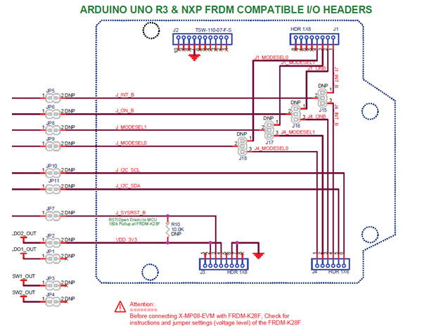](Hardware_rework.png)

  - Jumpers populated and connection details to run this application.

    [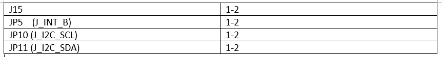](Jumper_rework.PNG)

  
    [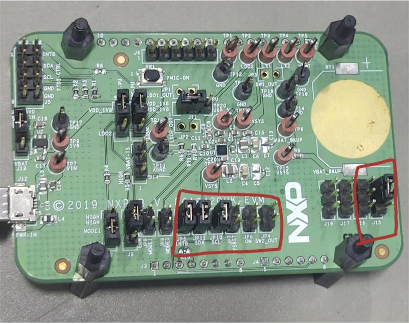](Hardware.jpg)

- PCA9420UK-EVM PMIC board default jumper setting to test the application.

  [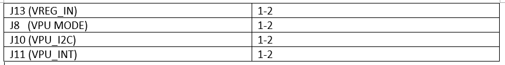](Default_jumper.PNG)

- User needs to make the connection between shield board (PCA9420UK-EVM) and Base boards (MCXA153 & MCXN947) using jumper wires.

  
                                                                     
  [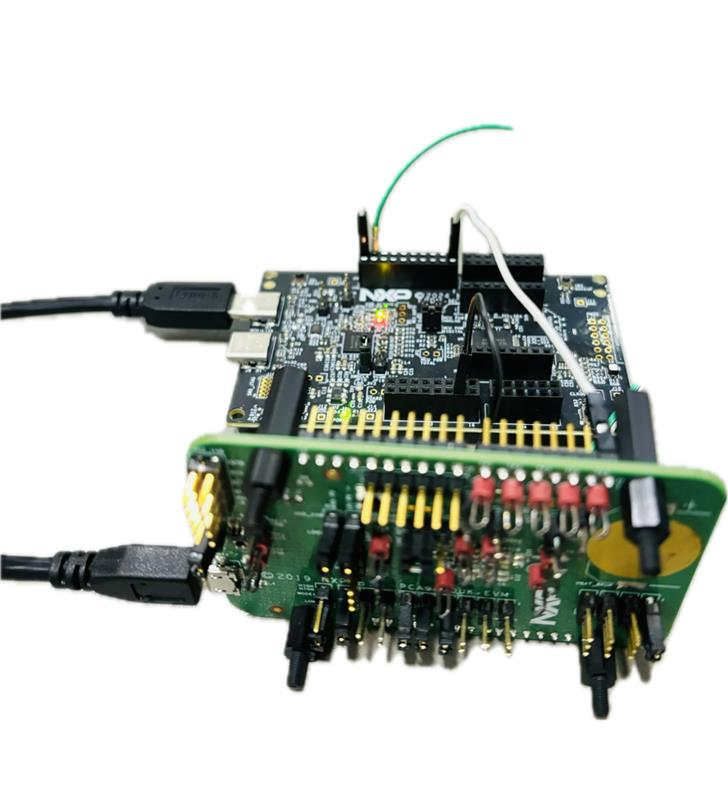](Hardware_setup.jpg)

## 3. Setup
### 3.1 Step 1: Download and Install required Software(s)
- Install MCUXpresso IDE 11.9.0
- Download and Install [MCUXpresso SDK v2.14.0 for FRDM-MCXN947](https://mcuxpresso.nxp.com/en/builder?hw=FRDM-MCXN947). Make sure to select ISSDK  middleware while building SDK.
- Download and Install [MCUXpresso SDK v2.14.2 for FRDM-MCXA153](https://mcuxpresso.nxp.com/en/builder?hw=FRDM-MCXA153). Make sure to select ISSDK  middleware while building SDK.
- Install Git v2.39.0 (for cloning and running west commands).
- Install Putty/Teraterm for UART.

### 3.2 Step 2: Clone the APP-CODE-HUB/dm-pca9420uk-evm-pmic-for-low-power-application
- Clone this repository to get the example projects:
- Change directory to cloned project folder: 
    cd *dm-pca9420uk-evm-pmic-for-low-power-application*
 
**Note:** If you are using Windows to clone the project, then please configure filename length limit using below command

**git config --system core.longpaths true**

### 3.3 Step 3: Build example projects
- Open MCUXpresso IDE and select a directory to create your workspace.
- Install MCXUpresso SDK 2.14.x for FRDM-MCX947, FRDM-MCXA153 (drag and drop SDK zip into "Installed SDK" view) into MCUXpresso IDE.
- Go to "Quickstart Panel" and click on "Import Project(s) from file system",
- Select "Project directory (unpacked)" and browse to the cloned project folder.
- **To build demo application for PCA9421UK-EVM, Enable PCA9421UK_EVM_EN flag in frdm_pca9420uk_shield.h file under board directory.**

      PCA9421UK_EVM_EN = 1, for PCA9421UK-EVM shield board 
      PCA9421UK_EVM_EN = 0, for PCA9420UK-EVM shield board

     [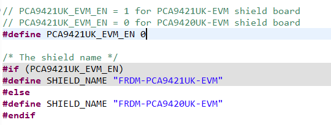](PCA9421_enable.PNG)

- Right click on project and select build to start building the project.

Note: By default I2C Controller operates in interrupt mode, to switch into EDMA mode Change:

- Change RTE_I2C2_DMA_EN to 1 under board/RTE_Device.h for I2C

## 4. Test Application Steps

- User need to check COM port after connecting USB cable between Host PC and Target Board via device manager.

  

- Open PUTTY/Teraterm application installed on your Windows PC with Baudrate 115200 and assigned COM port as mentioned in above step.

  

- After right click on project and select "Debug As", Demo application will run in interactive mode. When the demo runs successfully, you can see the logs printed on the terminal.

## 4.1 Execution steps

**Main Menu will look like this**

[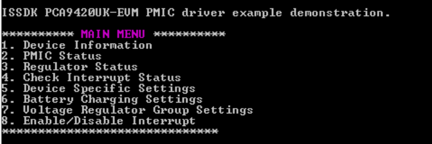](Main_menu.png)

**Choose options #1 to Get the Device Information** 
           
 [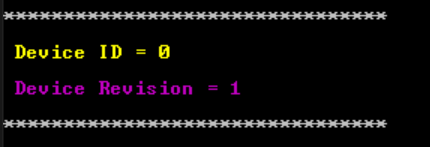](Device_info.png)
      
**Choose option #2 to check "PMIC Status"** 

    PMIC status will contain the mode information in which the device is currently operating and its corresponding voltage regulators output voltage configurations.   

  [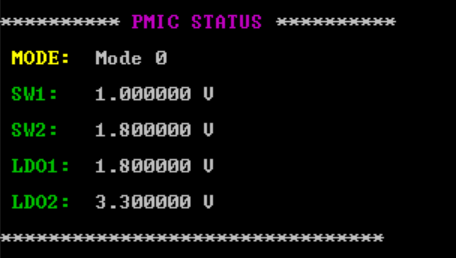](PMIC_status.png)

**Choose option #3 to check "Regulator Status"** 

    Regulator status will display the power-good status of voltage regulators.
     
  [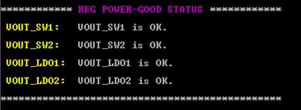](Regulator_status.png)
    
**Choose option #4 to check "Interrupt Status"** 

    To check the status of different types of interrrupt like:
    1) System level interrupt
    2) Linear battery charger block interrupt
    3) Voltage regulator interrupt
     
  [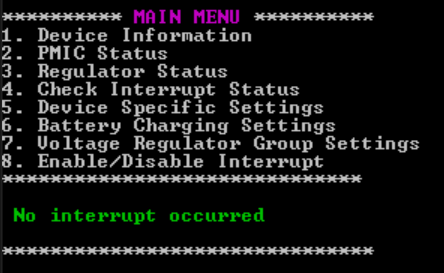](Interrupt_status.png)
 
 As shown above, currently there is no interrupt occurred.

**Choose option #5 to configure "Device Specific Settings"** 

 [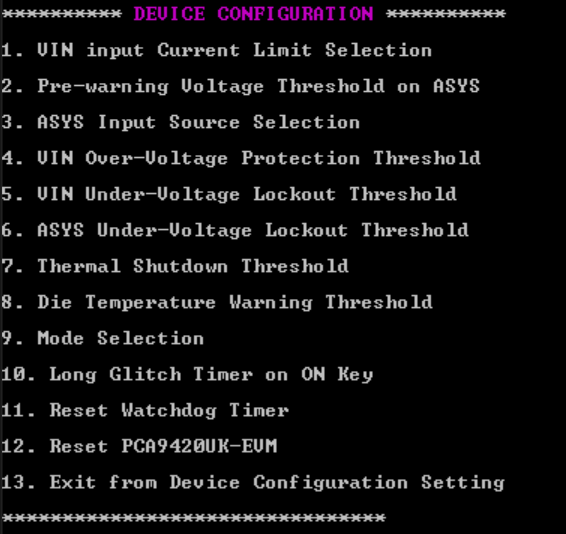](VIN_current_confg.png)

- Some key configurations examples are given below:
  - Press #1 to configure VIN input current limit.

     [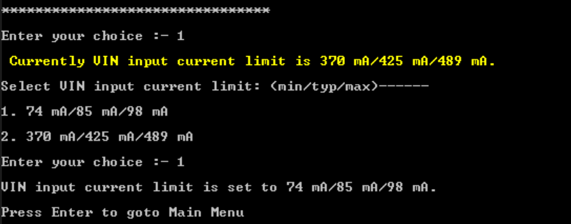](device_reset.png)

   - Press #9 to change the mode for device to operate in.

     [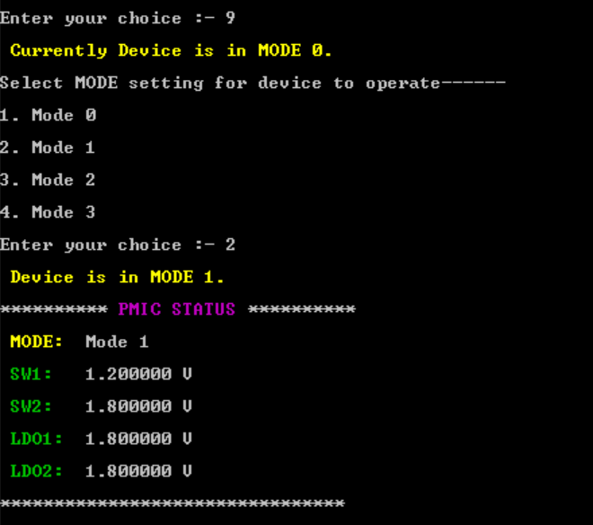](Mode_control.png)

   - Press #12 to reset the PMIC device.

     [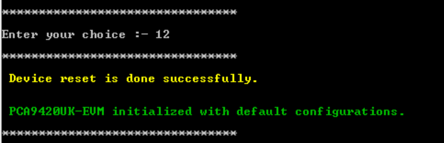](device_reset.png)

  NOTE: Refer above logs to configure other device settings.

**Choose option #6 to configure "Battery Charging Settings"** 

    It provides two sub-options:
    1) Charge control: To configure settings required for battery charging.
    2) Charge status: To check battery, battery charging and the charger status. 

 [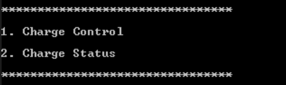](battery_charging.png)
 
  - Press #1 to configure charging parameters.
     
    [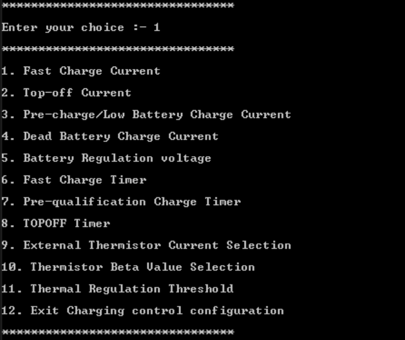](Charge_control.png)
    
        User can configure the charging current and charging timer for different charging profiles listed below:
        1) Dead battery mode
        2) Low-Voltage mode
        3) Fast Charge mode
        4) Top-OFF mode
        5) Charging Done mode
        6) Recharge mode

      - Press #3 to configure pre-charge/low battery charge current.

        [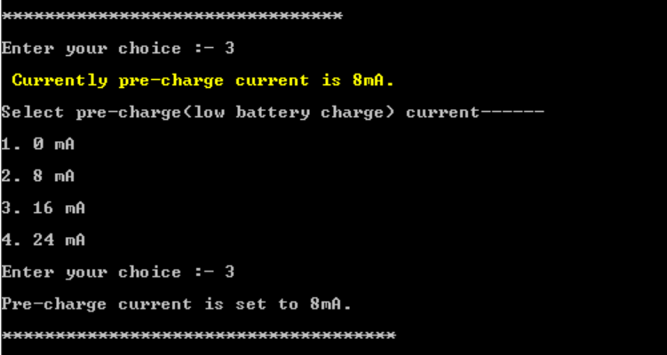](low_battery.png)

       NOTE: Refer above logs to configure other charging parameters.

- Press #2 to check the charging status.

      PCA9420UK-EVM can be a linear battery charger for charging of 1-cell rechargeable lithium ion battery. Battery can be connected on TP5 (VBAT point).

    [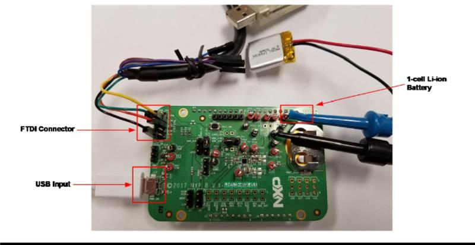](Battery_connection.png)
    

    - Charge detail status when 1-cell lithium ion battery is not connected.

      [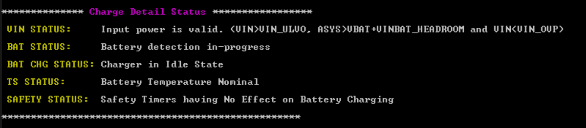](Charge_status1.png)
    
    - Charge detail status on connecting 1-cell rechargeable lithium ion battery on VBAT point.
   
      [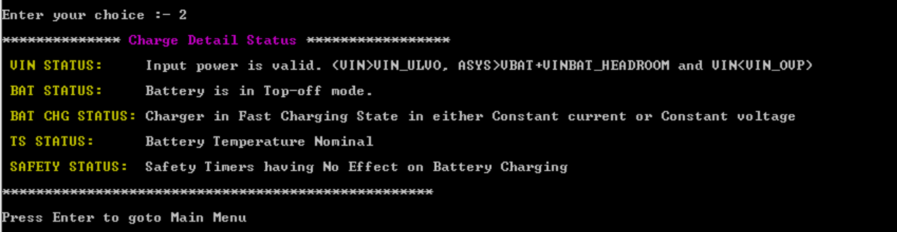](Charge_status2.png)
    

**Choose option #7 to configure "Voltage Regulator Group Settings"** 

    PCA9420UK-EVM board has 4 voltage regulators:
    1) SW1 Buck regulator
    2) SW2 Buck regulator
    3) LDO1 
    4) LDO2

- Press #1 to #4 to select specific mode

   [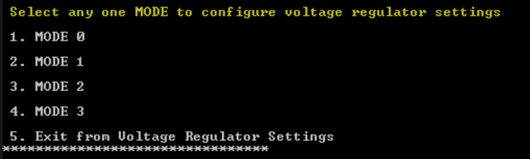](Mode_selection.png)

  - After entering specific mode, PCA9420 provides various voltage regulator configurations.

     [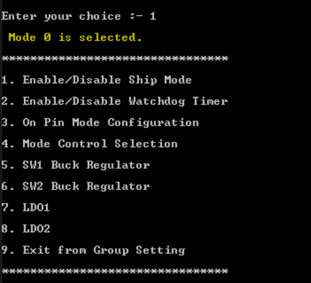](Mode_selection1.png)

     
  - Press #5 to configure the SW1 buck regulator output voltage.
    
     [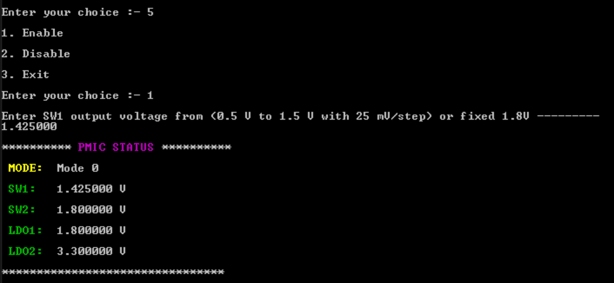](Mode_selection1.png)

  - Similarly other voltage regulators output can be configured. Shipmode enable/disable, watchdog timer enable/disable and ON pin configurations can also be done.

NOTE: For mode selection via MODESEL0 and MODESEL1 external line, configure jumper J7 and J9 on the board.

**Choose option #8 to "Enable/Disbale Interrupts"**

    PCA9420UK-EVM has 3 type of interrupt:
    1) System level interrupt
    2) Linear Battery charger block interrupt
    3) Voltage regulator interrupt 

  [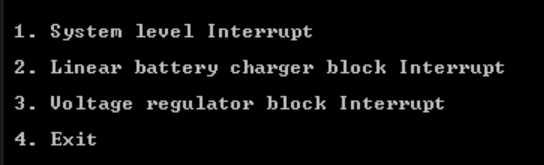](Interrupt_configuration.png)

-  Press #1 for System level interrupt configurations

   [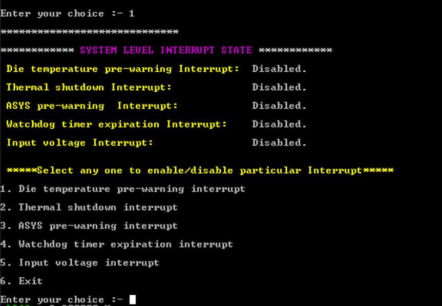](Interrupt_configuration1.png)

   - By default all the interrupts are disabled, so enabled die-temperature pre-warning interrupt.

     [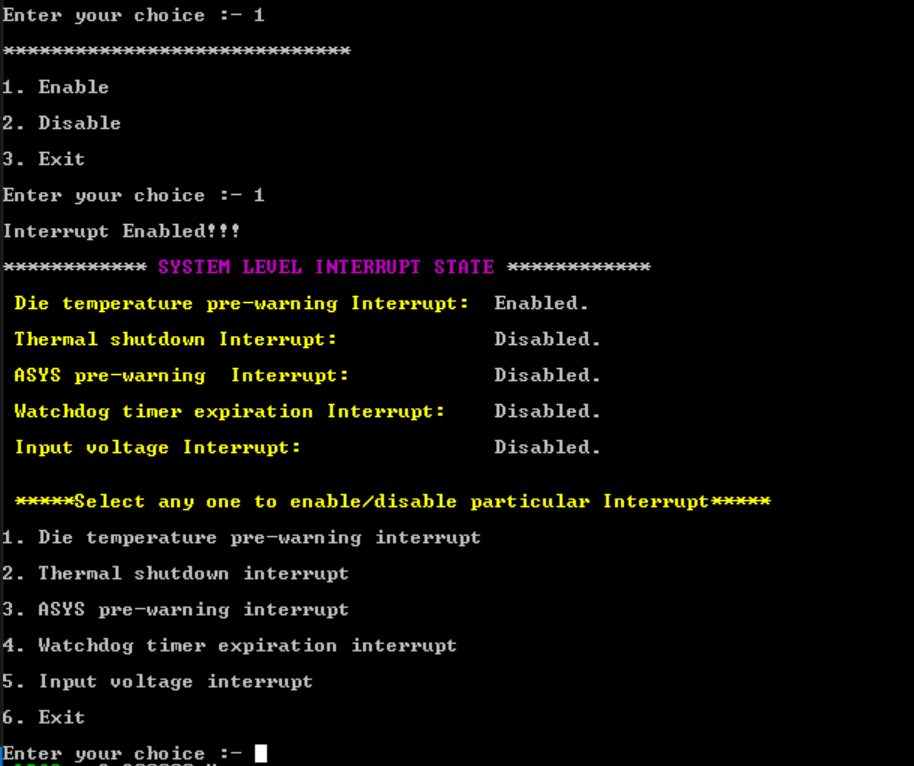](Interrupt_configuration2.png)

- Similarly any other interrupt can be enabled or disabled.

## 5. FAQs
*No FAQs have been identified for this project.*

## 6. Support

#### Project Metadata

<!----- Boards ----->

<!----- Categories ----->

<!----- Peripherals ----->

<!----- Toolchains ----->

Questions regarding the content/correctness of this example can be entered as Issues within this GitHub repository.

>**Warning**: For more general technical questions regarding NXP Microcontrollers and the difference in expected functionality, enter your questions on the [NXP Community Forum](https://community.nxp.com/)

## 7. Release Notes
| Version | Description / Update                           | Date                        |
|:-------:|------------------------------------------------|----------------------------:|
| 1.0     | Initial release on Application Code Hub        | December 17th 2024 |

